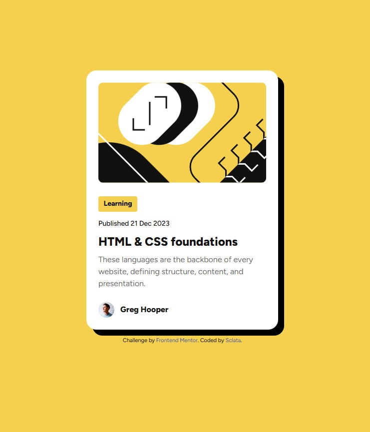

# Frontend Mentor - Blog preview card solution

This is a solution to the [Blog preview card challenge on Frontend Mentor](https://www.frontendmentor.io/challenges/blog-preview-card-ckPaj01IcS). Frontend Mentor challenges help you improve your coding skills by building realistic projects. 

## Table of contents

- [Overview](#overview)
  - [The challenge](#the-challenge)
  - [Screenshot](#screenshot)
  - [Links](#links)
- [My process](#my-process)
  - [Built with](#built-with)
  - [What I learned](#what-i-learned)
  - [Continued development](#continued-development)
- [Author](#author)

**Note: Delete this note and update the table of contents based on what sections you keep.**

## Overview

### The challenge

Users should be able to:

- See hover and focus states for all interactive elements on the page

### Screenshot

### Links

- Solution URL: [Add solution URL here](https://your-solution-url.com)
- Live Site URL: [Add live site URL here](https://your-live-site-url.com)

## My process

### Built with

- Semantic HTML5 markup
- CSS custom properties
- Flexbox
- SCSS
- BEM
- Mobile-first workflow

### What I learned

I've had issues with inheritance in the cascade and correct color rendering. Worked to enhance my understanding of this problem and got it right in this solution. Hadn't worked with the box-shadow property, but I loved :heart: that effect. Got more practice with SCSS and and structuring partitioned files. Really like the approach combined with BEM naming methodology.

### Continued development

Still want to work on my understanding of display modes, positioning, and relative units.

## Author

- Frontend Mentor - [@sclata](https://www.frontendmentor.io/profile/sclata)

